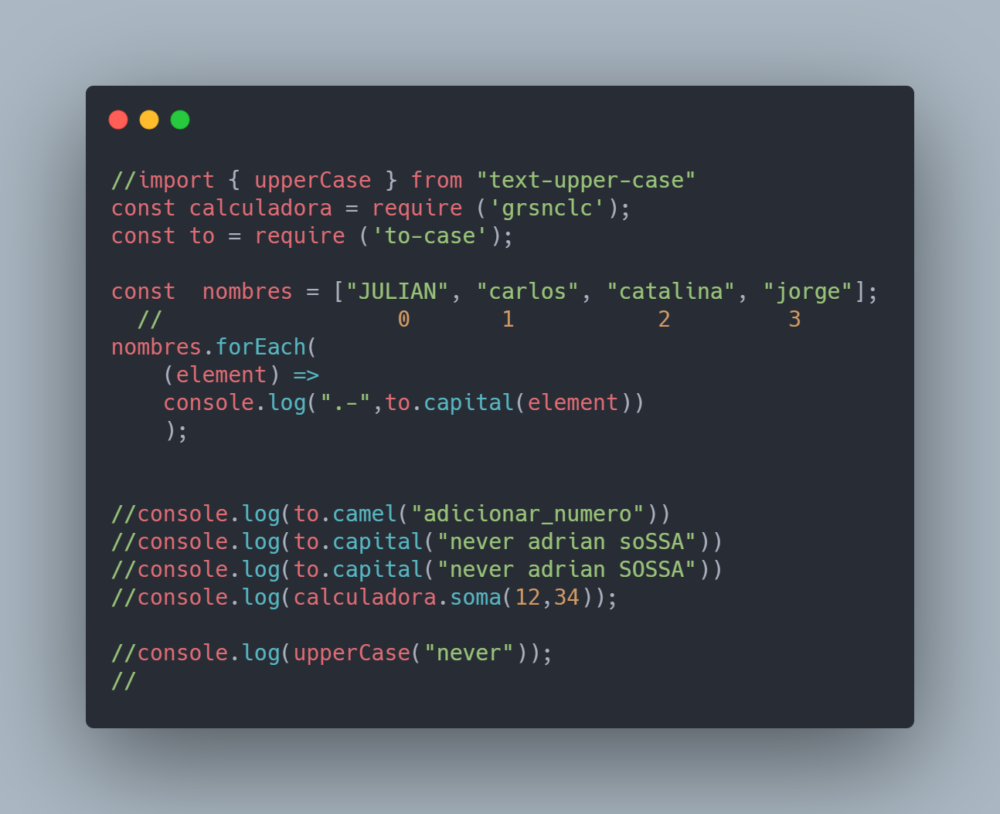

LIBRERIAS UTILIZADAS EN EL PROYECTO SIMPLE JS 
con commonjs👩‍💻👨‍💻⚡
Ejercicos realizados con javasccript como tambien manejo de arreglos, ES6

  - https://www.npmjs.com/package/img-dataset
  - https://www.npmjs.com/package/text-upper-case

  - https://www.npmjs.com/package/to-case

  **Free Software, Hell Yeah!**